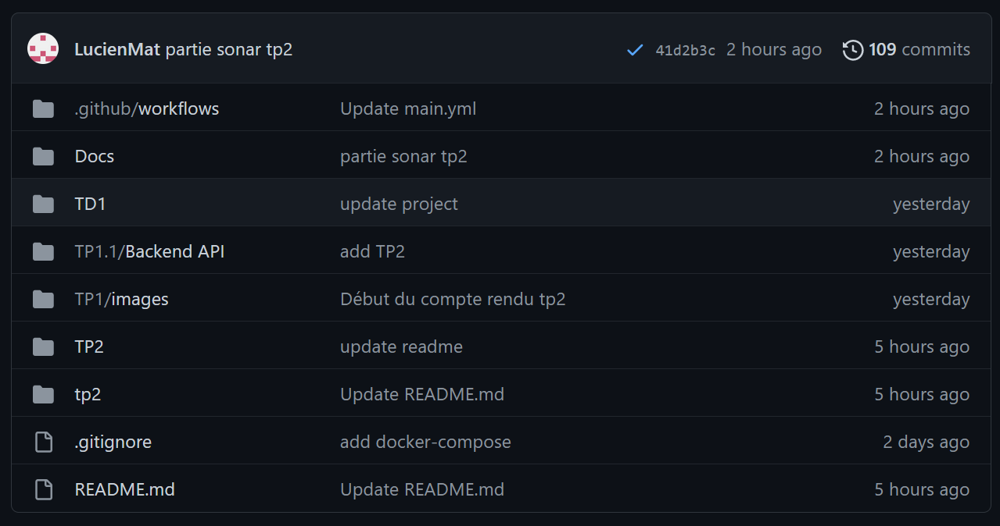
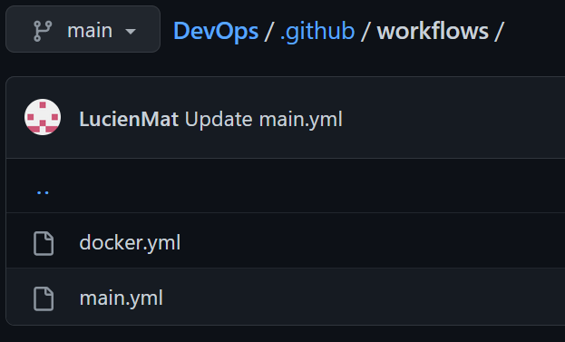

## Membres du groupe
    - Lucien MATHIEU
    - Guth MOELLE
    
# TP 2 - Discover Githun Action

## Notes
**yaml file** : fichier qui décris les étapes à lancer au moment de l'éxecution de la pipeline. Par exemple des tests, des vérification de synthaxe...

La commande `mvn clean verify` sert à nettoyer le projet avec clean afin de le rebuild et de le relancer proprement sans cache. Verify va build tous les modules de l'application et runner les tests pour s'assurer que les critères de qualité définis sont rempli (Tests unitaires et d'intégration). [Maven commands sheets](https://www.digitalocean.com/community/tutorials/maven-commands-options-cheat-sheet)\
La commande doit être lanceée depuis le dossier contenant `pom.xml` ou en précisant sa route avec `--file [path to pom.xml]`

**testcontainers** : présents dans le fichier `pom.xml` ce sont des containers issues de librairies java qui vont permttrent de lancer les tests et de lancer notre application en même temps.

---
## 1. Configuration du projet
Pour commencer on va créer un fichier `.github/workflows` à la base de notre projet. Il va nous servir à lancer les vérifications voulue avec une pipeline gérée par un fichier `main.yml` (et d'autres fichiers pour plusieurs pipelines plus tard).\


---
## 1. Configuration de main.yml
[main.yml file](../../.github\workflows\main.yml)

Pour indiquer quand lancer les  pipelines de tests, on configure sur quelle(s) branche(s) on va lancer les test en cas de push :
```
push:
   branches: [ "main"]
  pull_request:
    branches: [ "main"]
```
Ici nos tests seront lancés s'il y a un pull ou un push sur la branche "main"

On set up le container responsable des test dans le backend, intitulé `test-backend`. Il faut indiquer la version de Java à utiliser, quel JDK, le nom de la distribution ect...
```
- name: Set up JDK 17
        uses: actions/setup-java@v3
        with:
          java-version: '17'
          distribution: 'temurin'
          #cache: maven
```
*Attention bien mettre la v3 et commenté le cache*
Pour avoir un exemple de configuration aller sur le projet Github, onglet `Actions`, et `New workflow`. On a un exemple de fichier main.yml configuré, avec la version de java, la distribution...

Pour finir on indique la commande à run pour lancer les tests :
```
#finally build your app with the latest command
      - name: Build and test with Maven
        run:  mvn clean verify --file /./TP2/simple-api/pom.xml
```
*Mettre le chemin vers le pom relatif au fichier main*
On retrouve `mvn clean verify` (cf. Notes), avec le chemin qui amène vers le fichier pom.xml qui contients les différents testcontainers

---
## 2. CD World
On va à présent ajouter un pipeline qui va nous permettre de stocker nos images sur un site distant. On va utiliser `DockerHub` à qui on enverra nos images testées après chaque commit sur le `main`.\
Pour ça on créé un second fichier dans le dossier workflows appelé `docker.yml`. Il nous servira à se connecter à Dockerhub et à envoyer nos images

---
## 2. Ajout des variables secrets dans Github
On va ajouter dans les variables secrets de notre Github de quoi se connecter à Dockerhub pour pouvoir ensuite pousser nos images dessus.

Sur Github : `Settings` -> [Dans l'onglet Security] `Secrets and variables` -> `Actions` -> `New Repository Secret`

Ici, on va indiquer notre nom d'utilisateur Dockerhub, en nommant la variable `DOCKERHUB_USERNAME`, nom que l'on réferencera dans nos configurations de workflow.\
On fait la même chose pour le token d'indentification que l'on nomme `DOCKERHUB_TOKEN`\
\
Pour obtenir un token sur Dockerhub, se connecter puis : `Account Settings` -> `Security` -> `New Access Token`

---
## 2. Configuration de docker.yml
[docker.yml file](../../.github\workflows\docker.yml)

---
### 1ère étape - Connexion
Connexion vers DockerHub en utilisant les variables secrets :
```
- name: Login to DockerHub
      run: docker login -u ${{ secrets.DOCKERHUB_USERNAME }} -p ${{ secrets.DOCKERHUB_TOKEN }}
```
Cette partie du code est à placer avant tous les push vers Dockerhub

---
### 2ème étape - Pushs
On défini ensuite les push des différentes images après chaque commit :
```
 - name: Build image and push backend
      uses: docker/build-push-action@v3
      with:
        # relative path to the place where source code with Dockerfile is located
        context: ./tp2/simple-api
        # Note: tags has to be all lower-case
        tags:  ${{secrets.DOCKERHUB_USERNAME}}/simple-api
        # build on feature branches, push only on main branch
        push: ${{ github.ref == 'refs/heads/main' }}
```
On voit qu'on utilise bien la variable secrète `DOCKERHUB_USERNAME`, on s'en sert pour référencer les images à envoyer en indiquant leur nom sur Dockerhub (ici simple-api, postgres-database et httpd)\
On réécris cette partie en l'adaptant pour toutes les imaes que l'on veut vérifier et envoyer sur Dockerhub.

---
### 3ème étape- Condition de lancement
**En plus :** On rajoute un `if` pour que le workflow se lance bien à la suite de celui fais avec le main.yml :
```
jobs: 
 build-and-push-docker-image:
  runs-on: ubuntu-22.04
  if: ${{github.event.workflow_run.conclusion == 'success'}}
```
Note : `need` ne marche que avec les pipelines qui se trouvent dans le même workflow. Si on cherche à lancer en fonction d'un autre workflow il faut utiliser `if`

---
On peut maintenant tester les workflows en faisant un commit :\
\
Les workflows main.yml et docker.yml marchent, et se lancent l'un à la suite de l'autre comme prévu

On va vérifier qu'ils ont bien été mis à jour sur DockerHub :\


---
## 3. Sonar quality gates
Pour commencer il faut se créer un compte sur SonarCloud\
Ensuite, on créé une nouvelle organisation et un nouveau projet dans Sonar. Au moment de la création du projet choisis la méthode d'analyse `GitHub Actions`. Sonar va nous demander d'ajouter une variable secrète dans Github, intitulée `SONAR_TOKEN` avec comme valeur le token indiqué par sonar :\
\


On modifie ensuite dans `main.yml` la commande executé avec Maven pour qu'elle soit reliée à Sonar :
```
mvn -B verify sonar:sonar -Dsonar.projectKey=devops-moelle-mathieu_devops -Dsonar.organization=devops-moelle-mathieu -Dsonar.host.url=https://sonarcloud.io -Dsonar.login=${{ secrets.SONAR_TOKEN }}  --file ./tp2/simple-api/pom.xml
```
Il faut bien indiqué la `projectKey` et l'organisation, on trouve ces variables dans Sonar dans `information` après avoir sélectionner le projet

Normalement après avoir commit, on pourra voir le résultat des quality gates sur Sonar :\
\
Ici on voit que les quality gates ne sont pas validées, ce qui est normal pour notre projet. Mais les vérifications ont bien eues lieu

---
## Split pipelines
Le split de pipelines revient à séparer les différentes étapes à réaliser en plusieur pipelines, en plusieurs fichiers. Au lieu de tout regrouper dans un seul fichier on peut séparer en plusieurs, comme nous avec `main.yml` et `docker.yml`. Il faut tout de même faire attention à ce que les différentes pipelines soient lancées au bon moment si besoin (voir la condition `if` dans le `docker.yml`)\
\
Cela permet plus de flexibilité dans les étapes de tests, est plus facile à maintenir et à faire évoluer mais demande davantage de rigueur en ce qui concerne l'organisation des pipelines.

---
