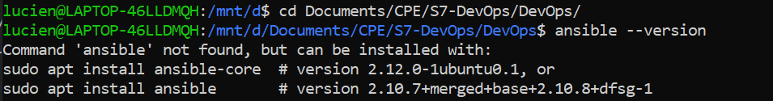
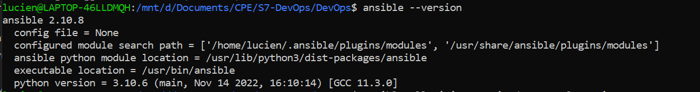
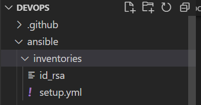
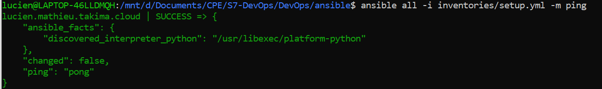
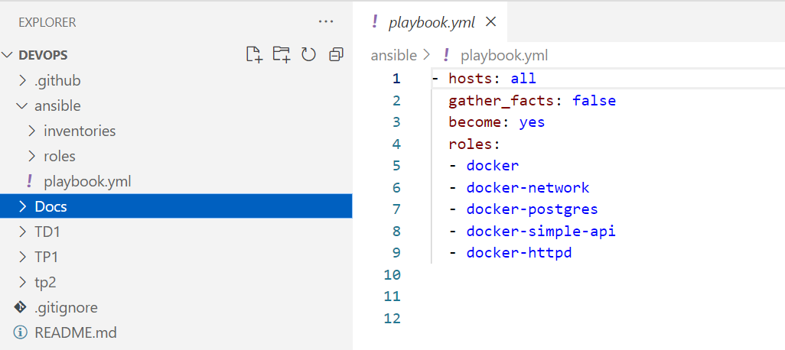
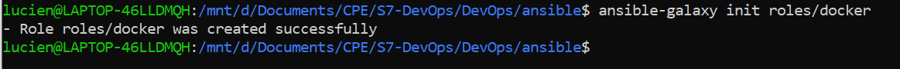
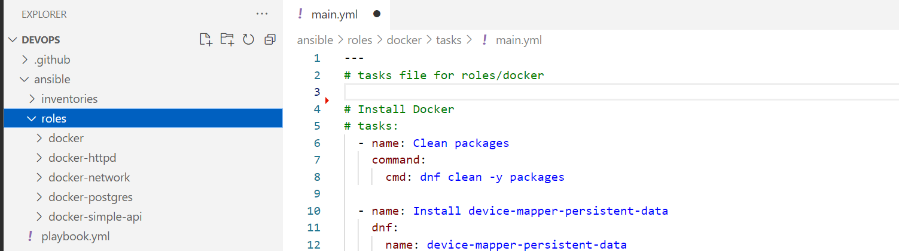
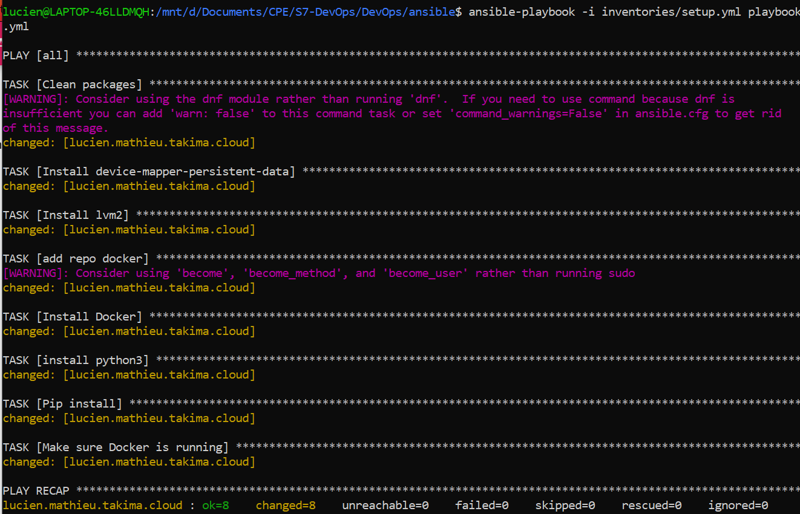

    
# TP 3 - Discover Ansible

## Membres du groupe
    - Lucien MATHIEU
    - Guth MOELLE

## Install Ansible
Pour commencer il faut installer Ansible, sous Windows il faudra passer par un Sous-système Linux (WSL).\
Nous avons utilisé un sous-styème Ubuntu. Une fois wsl (`wsl --install`) et Ubuntu installés, on va venir se placer dans notre projet avec : `cd /mnt/path/to/project` le mnt sert à relier le sous système Linux au fichiers Windows\

On voit avec `ansible --version` que Ansible n'est pas encore installé. Pour l'installer `sudo apt install ansible` (si le package n'est pas reconnu, bien mettre à jour apt avec `sudo apt update` et `sudo apt upgrade`).\
On peut vérifier que Ansible est bien installé :


On peut maintenant commencer le TP

## Inventories
Créer un nouveau dossier ansible/inventories qui va contenir le setup d'Ansible et la clé privée.**

Le fichier setup.yml va servir à se connecter à la machine virtuelle (VM) avec comme données d'authentification, la clé ssh et le nom de l'host. 
```
all:
 vars:
   ansible_user: centos
   ansible_ssh_private_key_file: /mnt/d/Documents/CPE/S7-DevOps/DevOps/ansible/inventories/id_rsa
 children:
   prod:
     hosts: lucien.mathieu.takima.cloud
```
Le chemin vers la clé ssh est bien à mettre en fonction du sous-système Ubuntu, donc en rajoutant `/mnt/` au début.\
Le host sera le lien par lequel on pourra se connecter pour vérifier le fonctionnement d'Ansible.

On test la connexion avec `ansible all -i inventories/setup.yml -m ping` :



## Playbook
Créer un fichier de configuration de playbook**. Le fichier playbook.yml va permettre de lancer séquentiellement les rôles définis dans ce dernier via le champ **roles**. 


**Création des roles**


**Voir les roles créés**



**Lancer playbook**



