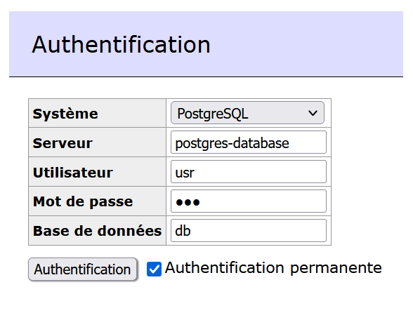

# TP 1 - Discover Docker

[TP 1](http://school.pages.takima.io/devops-resources/ch1-discover-docker-tp/)

---
## Database
Pour build l'image de la database :
```
docker build -t lucienmat/postgres-database .
```

Pour run le container :
```
docker run -p 8888:5000 --name postgres-database lucienmat/postgres-database
```

En rajoutant la connexion avec adminer :
```
docker run -p 8888:5000 --name postgres-database --network app-network lucienmat/postgres-database
```
Il faut bien créer un nouveau réseau, ici le réseau app-network :
```
docker network create app-network
```

Pour visualiser la database, on utlisez adminer :
```
docker pull adminer
```

On va ensuite le lancer en le reliant au réseau où se trouve notre base de données:
```
docker run -p "8090:8080" --net=app-network --name=adminer -d adminer
```
On se connecte ensuite à la base de donnée en passant par adminer à l'addresse http://localhost:8090



---
**Tip** : En runnant le container avec -e pour indiquer les variables d'environnement (nom de la db, mdp ect...) on peut stocker ces variables de manière cryptées, pour ensuite les comparer avec celles reçues à leur tour cryptées.

---

