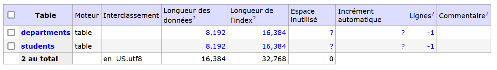
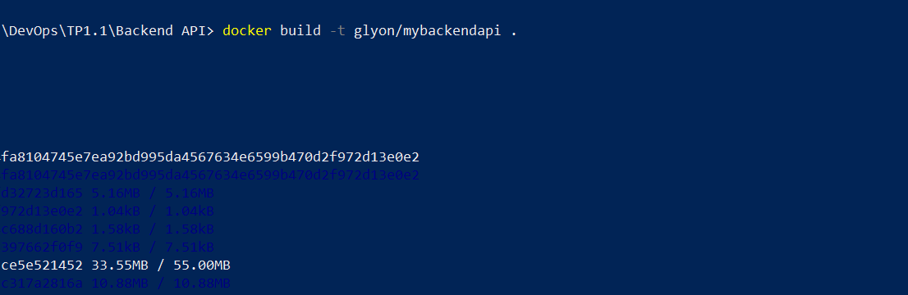

# TP 1 - Discover Docker

[TP 1](http://school.pages.takima.io/devops-resources/ch1-discover-docker-tp/)

---
## Database's Initialization
Pour build l'image de la database :
```
docker build -t lucienmat/postgres-database .
```

Pour run le container :
```
docker run -p 8888:5000 --name postgres-database lucienmat/postgres-database
```

En rajoutant la connexion avec adminer :
```
docker run -p 8888:5000 --name postgres-database --network app-network lucienmat/postgres-database
```
Il faut bien créer un nouveau réseau, ici le réseau app-network :
```
docker network create app-network
```

Pour visualiser la database, on utlisez adminer :
```
docker pull adminer
```

On va ensuite le lancer en le reliant au réseau où se trouve notre base de données:
```
docker run -p "8090:8080" --net=app-network --name=adminer -d adminer
```
On se connecte ensuite à la base de donnée en passant par adminer à l'addresse http://localhost:8090


## Load Database
On va créer des tables et les remplir de données, pour ça on utilise des fichers sql qui seront dans le dossier `/docker-entrypoint-initdb.d` du container. En relançant le container la base de données va run ces fichiers et donc créer les tables.\
Pour ajouter les fichiers on modifie Dockerfile :
```
COPY CreateScheme.sql /docker-entrypoint-initdb.d
COPY InsertData.sql /docker-entrypoint-initdb.d
```
Il ne reste plus qu'à supprimer le container actuel, rebuild et relancer :\

On vérifie que la base de données est bien mise à jour :


On peut également visualiser les données en utilisant pgAdmin

## Sauvegarder les données
Pour permettre de détruire le container sans pour autant supprimer les données stockées dans la base de données, il faut rajouter un volume. Il va permettre de stocker les données sans être affectué par l'état du container.\
Pour créer le volume, on va rajouter `-v /my/own/datadir:/var/lib/postgresql/data` dans la commande de run du container :
```
docker run -p 8888:5000 --name postgres-database --network app-network -v volume-postgres:/var/lib/postgresql/data lucienmat/postgres-database
```
On vérifie qu'il a bien été créé :
```
D:\Documents\CPE\S7-DevOps\DevOps\TP1.last\images\database>docker volume ls
DRIVER    VOLUME NAME
local     volume-postgres
```
On peut retrouver notre volume avec le chemin : `\\wsl$\docker-desktop-data\data\docker\volumes\volume-postgres`

## Spring Web
Récupération du Spring Initializr, et ajout du fichier `GreetingController.java` dans le projet Spring : \

Il faut ensuite créer un nouveau Dockerfile situé dans le projet Spring qui va permettre de configurer et de build l'app java 

---
**Tip** : En runnant le container avec -e pour indiquer les variables d'environnement (nom de la db, mdp ect...) on peut stocker ces variables de manière cryptées, pour ensuite les comparer avec celles reçues à leur tour cryptées.

---


## Backend API

**Main.java**




**Backend simple api**


**Backend API**


---
## Membres du groupe
    - Lucien MATHIEU
    - Guth MOELLE
